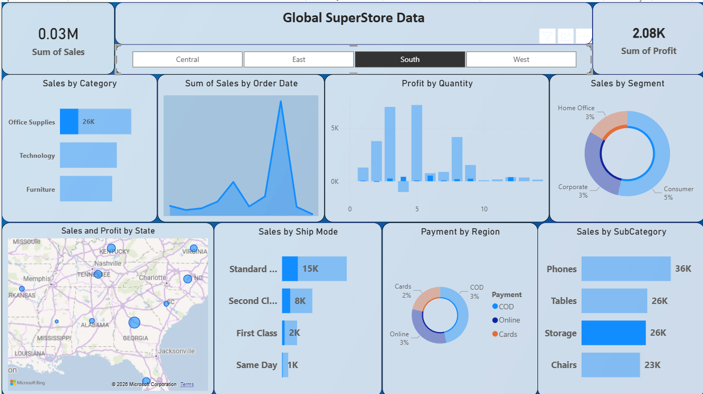

# SuperStore Sales Dashboard (Power BI)

## Project Overview
This project presents an interactive Power BI dashboard analyzing sales performance using the SuperStore dataset.

The dashboard provides insights into sales trends, regional performance, product categories, and customer segments.

## Key Features
- Total Sales and Profit KPIs
- Sales trend over time
- Category-wise sales performance
- Customer segment distribution
- Geographic sales visualization
- Shipping mode analysis
- Sub-category performance

## Tools Used
- Power BI
- Data Cleaning using Power Query
- Data Visualization

## Dataset
SuperStore Sales Dataset

## Dashboard Preview

